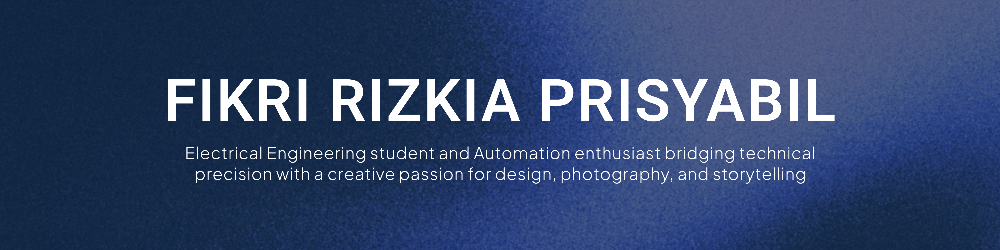

  

# Hello, I'm Fikri ! 👋

## About Me
Advancing in Electrical Engineering and Automation while channeling creativity through graphic design, photography, and impactful writing.

---

### Tech Stack & Tools

  
  
  
  
  

  
  

